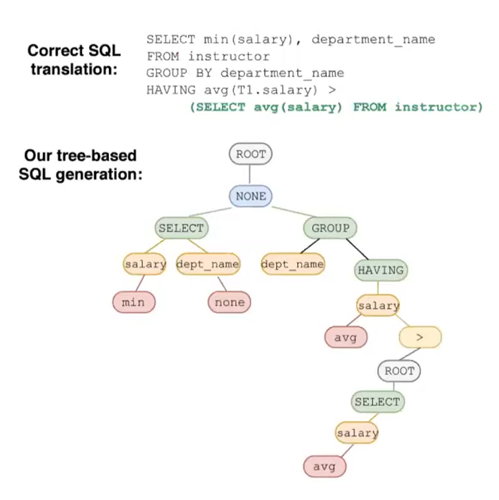
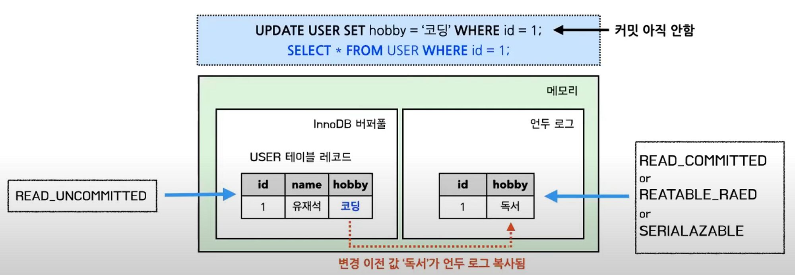

# Chapter 4. 아키텍처

### MySQL 스레딩 구조

> MySQL 서버는 프로세스 기반이 아닌 스레드 기반으로 작동

#### 1. 포그라운드 스레드(클라이언트 스레드)

- 최소 MySQL 서버에 접속된 클라이언트의 수만큼 존재 (각 사용자 요청 쿼리 문장 처리)
- 사용자가 커넥션 종료 시 스레드는 스레드 캐시로 되돌아감
  - 이미 스레드 캐시(Thread cache)에 대기중인 스레드 개수가 일정 수 이상이면 스레드 종료
  - `thread_cache_size` : 최대 스레드 개수 설정 값(시스템 변수)
- 포그라운드 스레드는 데이터 버퍼나 캐시를 통해 데이터를 가져옴
  - 버퍼나 캐시에 없을 경우에 직접 디스크의 데이터나 인덱스 파일로부터 데이터를 읽어와서 작업을 처리
- MyISAM 테이블은 디스크 쓰기 작업까지 포그라운드 스레드가 처리
  - 단 InnoDB 테이블은 데이터 버퍼&캐시까지만 포그라운드 스레드가 처리
  - 나머지 버퍼 ~ 디스크 기록 작업은 백그라운드 스레드가 처리

 

#### 2. 백그라운드 스레드

- InnoDB는 여러 작업을 백그라운드로 처리 (MyISAM은 해당 사항이 없음)
  - 인서트 버퍼를 병합하는 스레드
  - 로그를 디스크로 기록하는 스레드
  - InnoDB 버퍼 풀의 데이터를 디스크에 기록하는 스레드
  - 데이터를 버퍼로 읽어 오는 스레드
  - 잠금이나 데드락을 모니터링하는 스레드

- 데이터의 쓰기 작업은 지연(버퍼링)되어 처리될 수 있지만, 데이터의 읽기 작업은 지연 불가
  - 따라서 InnoDB 및 일반적인 상용 DBMS는 쓰기 작업을 버퍼링해서 일괄 처리하는 기능이 탑재
  - MyISAM은 사용자 스레드가 쓰기 작업까지 함께 처리하도록 설계

 

## 쿼리 실행 과정

> 쿼리 캐시 → 쿼리 파서 → 전처리기 → 옵티마이저 → 쿼리 실행 엔진 → 스토리지 엔진

### 1. 쿼리 캐시

- 쿼리 캐시는 동일 SQL의 결과 값을 빠르게 반환할 수 있도록 SQL 실행 결과를 메모리에 캐싱하는 역할이다
- 하지만 테이블의 데이터가 변경될 경우 캐싱 데이터를 삭제하는데, 이 때 쿼리 캐시에 접근하는 쓰레드에 락(Lock)이 걸림 → 동시 처리 성능 저하 유발
- 따라서 **MySQL 8.0부터 완전히 제거됨**

 

### 2. 쿼리 파서

- 기본적인 SQL 문장 오류를 체크한다
- 또한 SQL 문장을 의미있는 단위의 토큰으로 쪼갠 후 트리(Parse Tree)로 만듬
  - `Parse Tree`: MySQL은 내부적으로 트리를 사용하여 쿼리를 실행

    

 
  
### 3. 전처리기

- Parse Tree를 기반으로 SQL 쿼리 문장에 구조적인 문제가 있는지 체크
- Parse tree의 토큰을 하나씩 검증하면서 유효한지 체크
  - 테이블, 컬럼 등이 실제로 존재하는지?
  - 접근 권한이 있는지? 등등

 

### 4. 옵티마이저

- SQL을 최적화해서 실행시키도록 쿼리 실행 계획을 수립
- 최적화 방법
  - 규칙 기반 최적화 : 옵티마이저에 내장된 우선 순위에 따라 실행 계획 수립
  - 비용 기반 최적화 : SQL을 처리하는 다양한 방법의 각 비용과 테이블 통계 정보를 통해 실행 계획을 수립

 

### 5. 쿼리 실행 엔진

- 옵티마이저가 만든 쿼리 실행 계획대로 스토리지 엔진을 호출해서 쿼리를 수행(레코드 읽기/쓰기)하는 역할

 

### 6. 스토리지 엔진 (핸들러)

- 쿼리 실행 엔진이 요청한대로 데이터를 디스크에 저장하거나 읽어오는 역할
- 플러그인 형태로 제공되므로 사용자가 원하는 스토리지 엔진을 선택해서 사용 가능
  - InnoDB 스토리지 엔진
  - MyISAM 스토리지 엔진

 

<aside>
💡 MySQL 8.0부터는 플러그인 아키텍처를 보완하기 위해 컴포넌트 아키텍처를 제공한다

왜?
MySQL은 스토리지 엔진을 비롯해 검색어 파서, 사용자 인증 모듈 등도 플러그인 형태로 제공한다.
하지만 플러그인끼리는 통신할 수 없으며, 플러그인은 MySQL 서버의 변수나 함수를 직접 호출하여 캡슐화를 위배한다는 단점이 있다

</aside>

 

### InnoDB 스토리지 엔진 특징

#### PK에 의한 클러스터링

- Primary Key를 기준으로 데이터를 묶어서 저장 (PK 순서대로 레코드 정렬 후 디스크에 저장)
- InnoDB는 PK를 통해서 데이터 파일에 접근
- PK에 대한 인덱스를 자동으로 생성해줌
  - 만약 PK를 지정하지 않으면 내부적으로 PK를 자동 생성해서 클러스터링 진행
  - 하지만 자동 생성된 PK는 사용자가 사용하지 못하므로 웬만하면 PK를 지정해주자

 

<aside>
💡 PK에 의한 클러스터링은 읽기 성능을 얻고 쓰기 성능을 내주는 Trade-Off
(일반적인 앱 서비스는 쓰기보다 읽기 요청이 훨씬 많기 때문에 합리적인 Trade-Off)

클러스터링을 할 시 PK 기반 범위 검색 속도는 매우 빨라진다
→ PK 기준으로 데이터가 정렬되어 한 군데에 묶여서 저장되기 때문
하지만 쓰기 성능은 저하된다
→ PK 값이 바뀐다면 그에 따라 레코드의 물리적 순서도 하나씩 바꿔줘야 하기 때문

</aside>

 

#### 트랜잭션 지원 (MVCC, 리두 로그 & 언두 로그, 레코드 단위 잠금)

- MVCC : 트랜잭션 격리 레벨에 따라 조회되는 데이터가 달라지는 기술  
  (Multi Version Concurrency Control : 다양한 버전이 동시에 관리)
  - 데이터를 메모리 내부의 `InnoDB 버퍼풀`에서 조회하는지(READ_UNCOMMITTED)
  - 메모리 내부의 `언두 로그`에서 조회하는지(나머지 격리 수준 3개)

    

  - 이런 방식으로 레코드에 락을 걸지 않고도 트랜잭션 격리 레벨에 따라 `일관된 읽기`를 할 수 있음

 

- 언두 로그 : 변경되기 이전 데이터를 백업
  - 롤백 시 언두 로그에 백업된 데이터를 복원하면 되므로 트랜잭션이 보장됨
  - 또한 트랜잭션 격리 수준에 맞게, 다른 트랜잭션에서 레코드 조회 시 백업된 데이터를 반환
- 리두 로그 : 변경된 데이터를 백업 (Commit이 완료된 데이터)
  - MySQL 서버가 비정상 종료가 되더라도, 백업해 놓은 변경된 데이터들을 그대로 복원하면 되므로 트랜잭션의 영속성을 보장

 

- InnoDB 레코드 단위 잠금 (레코드 하나가 아닌, 인덱스 레코드를 잠그는 방식)
  - 인덱스를 기준으로 묶여있는 관련 데이터들이 싹 다 잠김
  - 테이블 인덱스가 아예 없다면 기본으로 생성된 PK 인덱스를 사용하여 테이블 풀스캔
    - Update 시 where절에 있는 데이터를 찾을 때 까지 풀스캔
    - 이 경우에도 검색에 사용된 모든 PK 인덱스가 잠김
    - 따라서 검색(where절)할 때 자주 사용되는 컬럼에 대한 인덱스를 잘 설정해주어 레코드 잠금 범위를 최대한 좁혀주자!!

 

#### InnoDB 버퍼풀 & 어댑티브 해시 인덱스

- InnoDB 버퍼풀
  - 데이터 캐싱 : 디스크의 데이터 파일이나 인덱스 정보를 메모리에 캐싱해두는 공간
    - SQL 요청에 대한 결과값을 일정한 크기의 페이지 단위로 캐싱
    - 테이블 데이터를 페이징하여 관리하고, 페이지 교체 알고리즘(LRU)을 사용
  - 쓰기 지연 버퍼 : 쓰기 작업을 지연시켜 일괄적으로 작업을 처리해주는 기능
    - 더티페이지 : Insert, Update, Delete 명령에 의해 변경된 페이지
    - 해당 더티 페이지들을 모았다가 주기적으로 이벤트를 발생시켜 한번에 디스크에 반영
      - 랜덤 I/O를 줄이는 효과

 

- 어댑티브 해시 인덱스
  - 페이지에 빠르게 접근하기 위한 해시 자료구조 기반 인덱스
  - 사용자가 자주 요청하는 데이터에 대해 InnoDB가 자동으로 생성해주는 인덱스  
    (쿼리를 더욱 빠르게 실행해주도록 도와줌)

 

### MyISAM 스토리지 엔진 특징

- 클러스터링 & 트랜잭션 & 외래키 지원을 안함
- 레코드 단위가 아닌 테이블 단위 잠금 → 동시 처리에 불리
- InnoDB의 버퍼풀 같은 역할을 하는 키 캐시가 존재
  - 단, 키 캐시는 인덱스 정보만을 대상으로 동작(버퍼링)함
- 전문 검색, 공간 좌표 검색 기능을 지원

 

<aside>
💡 예전에는 MyISAM 스토리지가 기본 스토리지 엔진으로 사용되는 경우가 많았다
MySQL 5.5 버전 이상부터는 InnoDB 스토리지 엔진이 기본 엔진으로 채택  
(시스템 테이블은 MyISAM)

하지만 MySQL 8.0 부터는 모든 테이블이 InnoDB 스토리지 엔진을 사용
또한 MyISAM에서만 지원하던 전문 검색, 공간 좌표 검색 기능을 InnoDB에서도 제공함으로써 계속해서 개선되지만 MyISAM의 개선은 이루어지지 않아 이후 버전에서는 MyISAM을 사용하지 않을 가능성이 높음

</aside>
