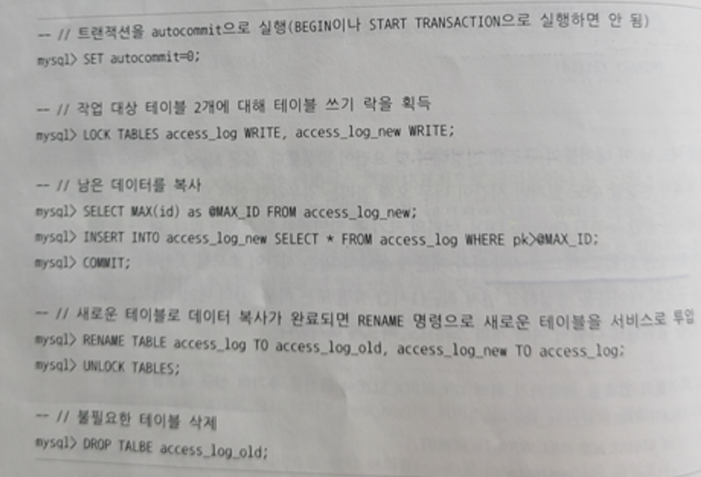
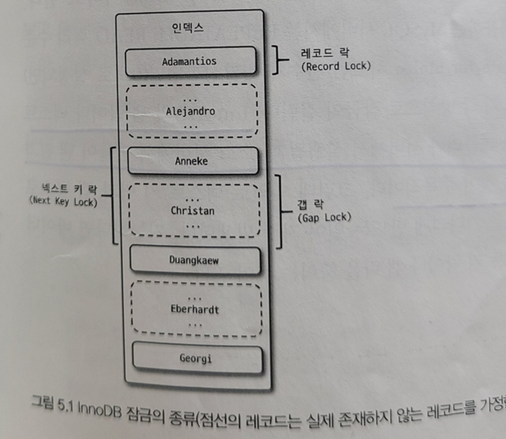

## Chapter 5. 트랜잭션과 잠금

- 트랜잭션 : 데이터의 정합성 보장
- 잠금 : 동시성 제어
- 격리 수준 : 하나 or 여러 트랜잭션 간의 작업 내용을 어떻게 공유하고 차단할 지 결정하는 레벨

 

## 트랜잭션

> 작업의 완전성을 보장해준다 (ACID 중 Atomicity(원자성))

- InnoDB 스토리지 엔진을 제외한 MyISAM, MEMORY 스토리지 엔진은 트랜잭션을 지원하지 않음
- 논리적인 작업 셋을 모두 완벽하게 처리하거나, 처리하지 못할 경우에는 원 상태로 복구하여 작업의 일부만 적용되는 현상을 막아준다
  - 하나의 논리적입 작업 셋에는 하나의 쿼리가 있든 여러 개의 쿼리가 있든 관계 없다
  - 단지 논리적인 작업 셋이 100% 적용(Commit) or 0% 적용(RollBack)

 

#### 주의점

- 프로그램 코드에서 트랜잭션의 범위를 최소화 해야 한다
  - DB 커넥션과 동일하게 최소한의 범위만 가져가야 안전하다
  - 일반적으로 DB 커넥션은 개수가 제한적이다
  - 근데 만약 트랜잭션 내부에서 외부 네트워크 통신 작업을 진행할 경우… 응답에 문제가 생겼으면 해당 트랜잭션에서는 DB 커넥션을 무한정 물고 있을 것이다 → DB 서버가 위험해짐

 

## MySQL 엔진과 스토리지 엔진의 잠금

- MySQL 엔진 레벨의 잠금 : 모든 스토리지 엔진에 영향
- 스토리지 엔진 레벨의 잠금 : 해당 스토리지 엔진에만 영향 (스토리지 엔진 간 상호 영향 X)

 

### MySQL 엔진의 잠금

#### 글로벌 락

> `FLUSH TABLES WITH READ LOCK`
>
- **MySQL에서 가장 범위가 큰 잠금**
- `**글로벌 락 명령어` 실행과 동시에 MySQL 서버에 존재하는 모든 테이블을 닫고 잠금을 검**
  - 만약 `글로벌 락 명령어` 실행 전에 다른 쓰기 잠금을 거는 SQL이 실행되고 있다면, 테이블 읽기 잠금을 걸기 위해 기다려야됨 (먼저 실행되는 SQL과 트랜잭션이 완료될 때 까지)
  - 한 세션에서 `글로벌 락` 획득 시, 다른 세션은 SELECT를 제외한 대부분의 DDL 문장 및 DML 문장이 대기 상태로 됨 (`글로벌 락`이 해제될 때 까지)
- **mysqldump 같은 백업 프로그램은 `글로벌 락 명령어`를 내부적으로 실행하고 백업할 때가 있다!!!**
  - 따라서 웹 서비스용으로 사용되는 MySQL 서버에서는 가급적 사용을 조심해야된다
  - 실무에서 필드 엔지니어 분이 mysqldump로 백업 DB를 자주 떠다 주셨는데, 이런 부분을 잘 확인 해야될 듯
- **MySQL 8.0 버전부터는 백업 툴들의 안정적인 실행을 위해 백업 락이 도입됨 (가벼운 글로벌 락)**
  - `Xtrabackup`, `Enterprise Backup`
  - 백업 락은 테이블의 스키마나 사용자의 인증 관련 정보를 변경할 수는 없지만, 일반적인 테이블의 데이터 변경은 허용
- **백업은 주로 레플리카 서버(slave 서버)에서 실행된다!!**
  - 애플리케이션이 주로 사용하는 소스 서버(master 서버)에서 백업을 진행하는 것은 위험한 요소가 많을 것 같음

 

#### 테이블 락

> 명시적 (`LOCK TABLES table_name [ READ | WRITE ]`), 묵시적
>
- **개별 테이블 단위로 설정되는 잠금**
- InnoDB 테이블은 스토리지 엔진이 기본적으로 레코드 기반 잠금을 제공하므로, 단순 데이터 변경 쿼리 실행 시 `테이블 락`이 설정되어도 DML 쿼리에서는 무시된다 (DDL만 영향을 미침)

 

#### 네임드 락

> `GET_LOCK()` 함수를 이용해 임의의 문자열에 대해 잠금을 설정할 수 있다
>
- **네임드 락의 잠금 대상은 데이터베이스 객체(테이블, 레코드, AUTO_INCREAMENT 등)가 아니다**
- **단순히 사용자가 지정한 문자열(String)에 대해 획득하고 반납(해제)하는 잠금**
  - 쿼리 실행 전, 쿼리를 분석할 때 해당 문자열을 가지고 판단하나?
- **네임드 락은 자주 사용되지는 않지만 배치 프로그램에서는 유용하게 사용될 수 있다**
  - 한꺼번에 많은 레코드를 변경하는 쿼리 실행 시 데드락이 자주 발생됨
  - 이 때 동일 데이터를 변경하거나 참조하는 프로그램끼리 분류해서 네임드 락을 걸고 쿼리를 실행하면 데드락이 효과적으로 회피됨
- 또한 MySQL 8.0 부터 네임드 락 중첩 사용 가능 및 현재 세션에서 획득한 네임드 락을 일괄 해제 가능

 

#### 메타데이터 락

> 데이터베이스 객체(ex. 테이블, 뷰)의 이름이나 구조를 변경하는 경우에 획득하는 잠금
>
- **명시적 획득 불가능 → 테이블의 이름을 변경하는 경우 자동을 획득하는 잠금**
  - `RENAME TABLE tab_a TO tab_b` 같은 경우 `tab_a`와 `tab_b` 모두 한꺼번에 잠금이 설정됨
- **만약 INSERT만 진행되는 로그 테이블의 구조를 변경해야 된다면?**
  - MySQL 서버의 DDL은 단일 스레드로 작동 → 상당히 많은 시간이 소모되며 해당 시간만큼 락이 걸림
  - 따라서 아래와 같이 진행하는 것이 좋음
    1. 새로운 구조의 테이블 생성
    2. 최근(1시간 직전 또는 하루 전)의 데이터까지는 프라이머리 키인 id 값을 범위별로 나눠서 여러 개의 스레드로 빠르게 복사
    3. 나머지 데이터는 트랜잭션, 테이블 잠금, RENAME TABLE 명령으로 응용 프로그램의 중단 없이 실행 가능 (다만 일시적으로 INSERT 웨이팅)
      - “남은 데이터를 복사”할 때는 테이블 락이 걸리므로, 가능하면 2번에서 아주 최근 데이터까지 복사해둬야 잠금 시간을 최소화 할 수 있음

       

  - 위처럼 RENAME을 해야 일시적으로(아주 짧은 시간) 테이블이 없는 현상을 방지할 수 있다

 

### InnoDB 스토리지 엔진 잠금

- InnoDB 스토리지 엔진 내부에서 레코드 기반의 잠금 방식을 탑재 → 뛰어난 동시성 처리 제공 가능
- 잠금 정보는 상당히 작은 공관으로 관리되므로 `레코드 락`이 `페이지 락`이나 `테이블 락`으로 레벨업되는 경우는 없다.

  

 

#### 레코드 락

- 레코드 자체만을 잠그는 것을 의미
- InnoDB 스토리지 엔진의 `레코드 락`은 레코드 자체가 아닌, `인덱스의 레코드`를 잠구는 특징
- 인덱스가 없다면 내부적으로 자동 생성된 클러스터 인덱스를 이용해 잠금을 설정
- 프라이머리 키 또는 유니크 인덱스에 의한 변경 작업은 레코드 자체에만 락을 건다
  - 하지만 보조 인덱스를 이용한 대부분의 변경 작업은 `넥스트 키 락` 또는 `갭 락`을 사용

 

#### 갭 락

- 레코드와 바로 인접한 레코드 사이의 간격만을 잠그는 것을 의미
- 레코드와 레코드 사이의 간격에 새로운 레코드가 생성(INSERT) 되는 것을 제어

 

#### 넥스트 키 락

- `레코드 락` + `갭 락`을 합쳐놓은 형태의 잠금
- 주 목적 : 바이너리 로그에 기록되는 쿼리가 레플리카 서버에서 실행될 떄(복제 될 떄) 소스 서버에서 만들어 낸 결과와 동일한 결과를 만들어내도록 보장하는 것
- 하지만 의외로 `넥스트 키 락`과 `갭 락`으로 인해 데드락이 발생하거나, 다른 트랜잭션을 기다리게 만드는 일이 자주 발생
  - 따라서 가능하면 `바이너리 로그 포맷` 보다는 `ROW 형태`로 바꿔서 넥스트 키 락이나 갭 락을 줄이자!
- MySQL 5.5 까지는 ROW 포맷의 바이너리 로그가 도입된지 별로 안돼 널리 사용이 안됐음
  - 하지만 8.0부터 업그레이드 되어 ROW 포맷의 바이너리 로그에 대한 안정성 증가
  - 또한 기존 STATEMENT 포맷(쿼리문 형식)의 바이너리 로그의 단점을 많이 해결해줄 수 있어 MySQL 8.0 부터 ROW 형식이 default

 

#### 자동 증가 락

> 한번 증가한 자동 증가 값은 절대 줄어들지 않는다 (`AUTO_INCREMENT` 잠금을 최소화 하기 위해)

- `AUTO_INCREMENT` : 테이블 수준의 잠금을 사용
- 새로운 레코드를 저장하는 쿼리(INSERT, REPLACE) 에서만 필요
  - UPDATE, DELETE는 필요하지 않음
  - REPLACE : 없으면 INSERT, 있으면 DELETE 후 INSERT
- 트랜잭션과 관계 없이 새 레코드 저장 쿼리에서 AUTO_INCREMENT 값을 가져오는 순간만 락이 걸렸다가 즉시 해제됨
- MySQL 5.1 이상부터 시스템 변수 `innodb_autoinc_lock_mode`를 통해 자동 증가 락의 작동 방식 변경 가능
  - `innodb_autoinc_lock_mode = 0` : 기존 모드
    - 기존 잠금 방식 : 모든 INSERT 문장은 자동 증가 락을 사용
  - `innodb_autoinc_lock_mode = 1` : 연속 모드
    - **단순 한건 또는 레코드의 건수가 정확히 예측 가능한 여러 건인 경우**
      - 자동 증가 락 대신 경량화된 래치(뮤텍스)를 이용해서 처리 (아주 짧은 시간 동안만 잠금을 걸고 자동 증가 값을 가져옴)
    - **건수를 예측할 수 없는 경우**
      - 자동 증가 락을 사용하지만, 여러 개의 자동 증가 값을 한번에 할당
      - INSERT 되는 레코드는 연속된 자동 증가 값을 보장받지만, 사용되지 못한 자동 증가 값은 폐기된다
  - `innodb_autoinc_lock_mode = 2` : 빠른 모드
    - 절대 자동 증가 락을 걸지 않고 경량화된 래치(뮤텍스)를 사용
    - 연속된 값을 보장하지는 않고, 유니크한 값이 생성된다는 것만 보장
    - 만약 해당 모드에서 STATEMENT 포맷의 바이너리 로그를 사용하는 복제에서는 소스 서버와 레플리카 서버의 자동 증가 값이 달라질 수 있다
      - 복제 환경에서는 raw 포맷을 사용해야 될 듯

 

### 인덱스와 잠금

- InnoDB의 잠금은 레코드 잠금이 아닌 인덱스 잠금 방식으로 처리
- 변경해야 할 레코드를 찾기위해 검색한 인덱스의 레코드들을 모두 락 처리
  - 검색 조건인 인덱스 설계를 제대로 잘 해줘야 할듯…
  - 만약 인덱스가 없는 테이블일 경우 `테이블 풀스캔`…

 

## MySQL 격리수준

> 여러 트랜잭션이 동시에 처리될 때 특정 트랜잭션이 다른 트랜잭션에서 변경하거나 조회하는 데이터를 볼 수 있게 허용할지 말지를 결정하는 것

|  | DIRTY READ | NON-REPEATABLE READ | PHANTOM READ         |
| --- | --- | --- |----------------------|
| READ UNCOMMITTED | 발생 | 발생 | 발생                   |
| READ COMMITTED | 없음 | 발생 | 발생                   |
| REPEATABLE READ | 없음 | 없음 | 발생   (InnoDB는 없음) |
| SERIALIZABLE | 없음 | 없음 | 없음                   |
- 위 순서대로 아래로 갈수록 각 트랜잭션 간의 데이터 격리(고립) 정도가 높아짐
- 따라서 동시 처리 성능 또한 아래로 갈수록 떨어지는 것이 일반적

 

### 부정합 3가지

- DIRTY READ
  - 트랜잭션에서 처리한 작업이 완료되지 않았는데도 다른 트랜잭션에서 볼 수 있는 현상
- NON-REPEATABLE READ
  - 하나의 트랜잭션 내에서 똑같은 SELECT 쿼리를 실행했을 때 다른 결과가 나오는 현상
  - 사용중인 트랜잭션의 격리 수준에 의해 실행하는 SQL 문장이 어떤 결과를 가져오게 되는지 정확히 예측할 수 있어야 되는데 해당 부정합에선 예측 불가
    - 입출금을 반복하는 금전적인 처리와 연결되는 경우 심각한 문제 발생 초래
- PHANTOM READ
  - 다른 트랜잭션에서 수행한 변경 작업에 의해 레코드가 보였다 안보였다 하는 현상

 

### READ UNCOMMITTED (커밋되지 않아도 읽기)

> 각 트랜잭션에서의 변경 내용이 COMMIT과 ROLLBACK 여부에 상관 없이 다른 트랜잭션에서 보이는 레벨

- 커밋되지 않은 상태에서도 이미 다른 트랜잭션에서는 변경된 데이터가 보임 (`DIRTY READ`)
- 이 말은 즉슨 롤백돼서 유효한 데이터가 아닌데도 다른 트랜잭션에서 사용될 가능성이 높음
- 데이터 정합성에 문제가 많은 격리 수준이다

 

### READ COMMITTED (커밋된 것만 읽기)

(Oracle 기본 격리수준)

> 어떤 트랜잭션에서 데이터를 변경했더라도 COMMIT이 완료된 데이터만 다른 트렌젝션에서 조회할 수 있는 레벨

- 만약 A 트랜잭션에서 데이터를 변경하고, COMMIT되기 전 B 트랜잭션에서 해당 데이터를 조회하면?
  - A 트랜잭션에서 데이터 변경 시, 이전 데이터는 언두 로그로 복사된다
  - 커밋이 발생되지 않은 시점에 B 트랜잭션이 조회할 경우, 언두 로그에 있는 백업된 데이터를 조회하도록 반환한다
- `**NON-REPEATABLE READ`라는 부정합의 문제가 있음 (REPEATABLE READ가 불가능 하다)**
  - B 트랜잭션에서 조회 → 결과 없음
  - A 트랜잭션에서 기존 데이터 변경 후 커밋
  - B 트랜잭션에서 종료되기 전에 한번 더 조회 → 결과 반환
  - 오잉?

 

### REPEATABLE READ (반복된 읽기)

(MySQL의 InnoDB 스토리지 엔진 기본 격리 수준)

> MVCC를 위해 언두 영역에 백업된 이전 데이터를 이용해 동일 트랜잭션 내에서는 동일한 결과를 보여줄 수 있게 보장한다.

- **SELECT 쿼리 문장은 트랜잭션 범위 내에서만 작동한다**
  - 따라서 해당 격리수준에서는 트랜잭션 내에서 실행되는 SELECT문장과 트랜잭션 없이 실행되는 SELECT 문장이 다르다
- **자기 자신 트랜잭션 번호보다 큰 번호의 트랜잭션이 변경한 데이터에 대해서는 보이지 않는다**
- 해당 격리수준에서는 MVCC를 보장하기 위해 실행 중인 트랜잭션 가운데 가장 오래된 트랜잭션 번호보다 트랜잭션 번호가 앞선 언두 영역의 데이터는 삭제할 수 없다
  - 언두 영역에 백업된 모든 레코드에는 변경을 발생시킨 트랜잭션의 번호가 포함되어 있다. 이를 활용한다
- #### 한 트랜잭션에서의 일관된 읽기를 지원하기 위해 SELECT 시 해당 operation을 수행한 시간을 기록하여, 현재 시점의 스냅샷을 만들고, 이후의 모든 read operation을 해당 스냅샷을 기준으로 consistent read(영속 조회)를 하여 조회하도록 만든다

 

#### REPEATABLE READ와 READ COMMITTED의 차이 (REPEATABLE READ 기준)

- 언두 영역에 백업된 레코드의 여러 버전 가운데 몇 번째 이전 버전까지 찾아 들어가야 하느냐의 차이
- 즉 트랜잭션 번호를 기준으로 데이터의 변경, 조회를 결정한다

 

### SERIALIZABLE

> 한 트랜잭션에서 읽고 쓰는 레코드를 다른 트랜잭션에서는 절대 접근할 수 없는 레벨

- 해당 격리수준으로 설정되면 읽기 작업도 공유 잠금(읽기 잠금)을 획득해야만 함
- 또한 동시에 다른 트랜잭션은 그러한 레코드를 변경하지 못하게 됨
- 레코드 락은 인덱스 락으로 걸리기 때문에 이걸 쓸때는 진짜 인덱스 설계를 잘해야 될 것 같음
